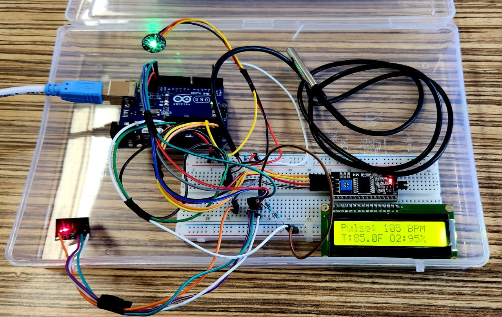

# 🩺 Arduino-Based Health Monitoring System

This project is a **portable and cost-effective health monitoring system** designed to measure and display three vital signs:
-  Heart rate using a Pulse Sensor
-  Body temperature using DS18B20
-  Blood oxygen (SpO₂) using MAX30100

It was developed as a **group mini-project** as part of a course.

---

## Objective

To build a basic yet effective health monitoring system using Arduino that displays real-time data on an LCD and over Serial Monitor.

---

## Components Used

| Component                          | Purpose                              |
|-----------------------------------|--------------------------------------|
| Arduino UNO                       | Microcontroller                      |
| Pulse Sensor                      | Measures heart rate (BPM)            |
| DS18B20 Digital Temperature Sensor| Measures body temperature (°C, °F)   |
| MAX30100 Pulse Oximeter           | Measures SpO₂                        |
| 16x2 LCD Display + I2C module     | Displays live data                   |
| Breadboard, jumper wires, resistors| Circuit connection                   |

---

## Features

- Live monitoring of:
  - ✅ Heart Rate (BPM)
  - ✅ Body Temperature (Celsius and Fahrenheit)
  - ✅ Blood Oxygen Level (SpO₂)
- LCD display with real-time updates
- Serial monitor logging
- Beat detection from both MAX30102 and Pulse Sensor
- Signal threshold filtering for improved accuracy

---

## Circuit Diagram

Below is the actual wired circuit used in the project:



---

## Sample Output

```bash
Pulse: 105 BPM
T: 96.0F O2: 97%
```

---

## How to Run

1. Connect sensors as shown in the circuit photo
2. Open the Arduino IDE
3. Upload the `health_monitor.ino` file to the Arduino UNO
4. Open the Serial Monitor (baud rate: 9600)
5. Watch the LCD and Serial Monitor display live health metrics

---

⭐ If you found this project useful or interesting, please consider giving it a ⭐ star — it helps others discover it too!

